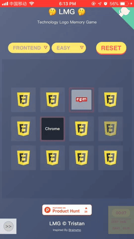
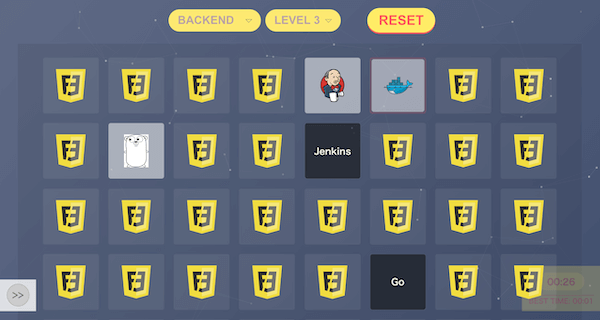

# 技术图标连连看

[English Version](README.md)

[记忆+连连看](https://zerosoul.github.io/frontend-memo-game/)

## 移动端

## 电脑端展现

## 特性

### 功能

- [x] 可以选择技术栈
- [x] 可以选择难度等级：容易、中等和困难
- [x] 可以把结果分享到微博、推特和脸书
- [x] 能够记录不同等级的最佳成绩
- [x] 支持**图标与图标**配对和**图标与标题**配对，两种玩法
- [x] 全屏玩耍
- [ ] APP 化：PWA
- [ ] 数据动态化（非本地存储）
- [x] 国际化（中文展示）
- [ ] 第一次玩，做引导

### 体验

- [x] 移动端体验优先考虑
- [x] 在合适的场景加入合适的动画，增加可玩性
- [x] 根据不同的屏幕尺寸展现不同尺寸的卡片容器，以便玩家看到的都是满行满列（~~一家人最重要的就是整整齐齐~~）
- [x] 精心挑选配色方案，让游戏看起来风格如一
- [x] 当点击开始按钮式，卡片容器自动顺滑地滚到可视区域
- [x] 游戏进行中，自动隐藏无关元素，让体验更沉浸式
- [x] 压缩图片，更快更好地加载体验
- [x] 为不同设备准备了不同尺寸大小的图标
- [x] iPhone & iPad 本地打开，有引导屏
- [x] 酷酷的动态背景，科技感十足

## 技术栈

- [create-react-app](https://github.com/facebook/create-react-app): 大家都在用的 react 项目构建架子
- [react](https://reactjs.org): 最流行的前端 UI 构建语言
- redux + react-redux: 最流行的 react 状态管理解决方案
- [styled-components](https://styled-components.com): react 中 css 解决方案，CSS-IN-JS 最佳实践
- eslint + prettier: 为了更好地编码
- husky + commitlint: 为了更好地 GIT 提交
- [particles.js](https://vincentgarreau.com/particles.js/): 科技感十足的动态背景（借助 canvas 技术）

## 更新日志

[更新日志](CHANGELOG.md)

## 寻求支持

